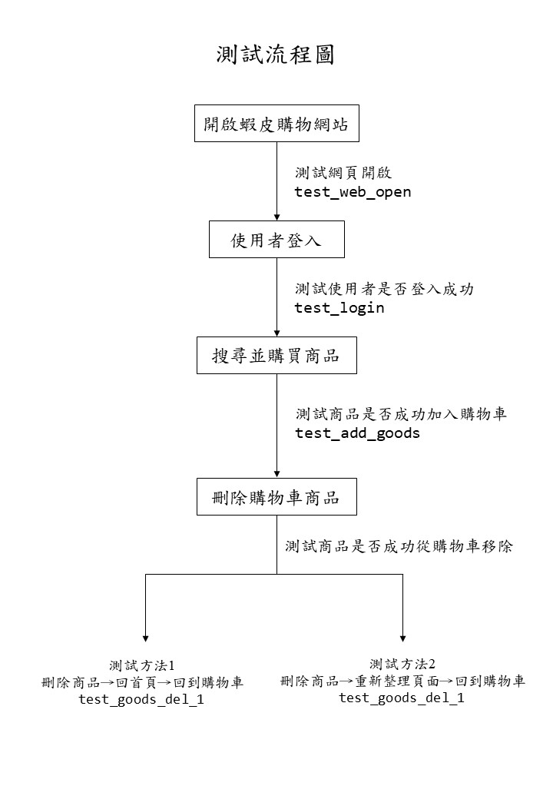

# 使用pytest+selenium測試蝦皮購物網站並用allure2生成測試報表
## 使用工具:
* pytest
  * fixture
* selenium
  * webdriverwait
* allure2
***
## 測試流程
我將這次測試分成了五個節點:
* 測試節點1:測試網站開啟是否成功(開啟網站後抓取網站的title是否為蝦皮購物的title)
* 測試節點2:測試使用者登入是否成功(登入後抓取使用者名稱是否正確)
* 測試節點3:測試商品是否加入購物車(將商品加入購物車後抓取購物車內是否有該商品的名稱)
* 測試節點4,5:測試商品是否成功從購物車移除
  * 這邊我將測試分成兩次，第一次是將購物車內商品移除後先回首頁在進入購物車查看商品是否還在，第二次是將購物車內商品移除後把網頁重新整理後查找購物車內商品是否還在。

***
## 環境建置
### 項目結構:
pytest_shopee內共有4個.py檔
* conftest.py
* myselenium.py
* shopee.py
* test_shopee.py
#### conftest.py
此檔案為pytest內建的功能，此檔案內的模塊可以直接被其他pytest檔的測試用例直接使用，不需要再import。
裡面放著蝦皮網站的driver，功能為在測試用例開始前開啟蝦皮網站，並在測試結束後關閉網站。

