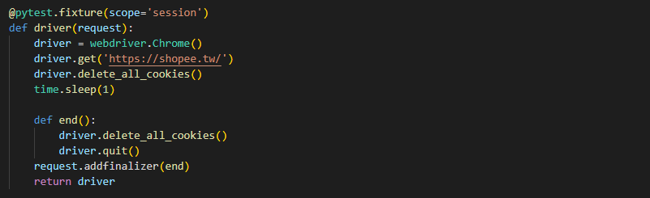

# 使用pytest+selenium測試蝦皮購物網站並用allure2生成測試報表
## 使用工具:
* pytest
* selenium
* allure2
***
## 測試流程
我將這次測試分成了五個節點:
* 測試節點1:測試網站開啟是否成功(開啟網站後抓取網站的title是否為蝦皮購物的title)
* 測試節點2:測試使用者登入是否成功(登入後抓取使用者名稱是否正確)
* 測試節點3:測試商品是否加入購物車(將商品加入購物車後抓取購物車內是否有該商品的名稱)
* 測試節點4,5:測試商品是否成功從購物車移除
  * 這邊我將測試分成兩次，第一次是將購物車內商品移除後先回首頁在進入購物車查看商品是否還在，第二次是將購物車內商品移除後把網頁重新整理後查找購物車內商品是否還在。

***
## 環境建置
### 項目結構:
pytest_shopee內共有4個.py檔
* conftest.py
* myselenium.py
* shopee.py
* test_shopee.py
### conftest.py
此檔案為pytest內建的功能，此檔案內的模塊可以直接被其他pytest檔的測試用例直接使用，不需要再import。
裡面放著蝦皮網站的driver，功能為在測試用例開始前開啟蝦皮網站，並在測試結束後關閉網站。

***
### myselenium.py
因為selenium的定位元素有時會因為網路延遲等問題無法正確的定位到，所以這邊我使用webdriverwait來代替find_element的功能來避免因一些外部因素讓程式出錯的情況發生。

***
之後再把send_keys及click等功能也一同做封裝的處理。

***
### shopee.py
這邊我也將之後測試要做到的登入、關鍵字搜尋及購買商品等操作也做封裝的處理、並使用alure的step函數對每一個模塊做說明的動作，可以讓之後的測試報表呈現起來更加值觀跟可閱讀。

***
### test_shopee.py
最後我將測試案例放在這個檔案裏面。        

***
## 測試結果
當測試案例成功執行後，便可以生成allure的測試報表。

測試成功的案例:

***
測試失敗的案例:

***
可以看到在測試模塊上加入文字說明能夠更直觀的明白測試的過程及結果。
那最後的測試結果，test_goods_del_1是輸出失敗，而test_goods_del_2是輸出成功。
那從以上的內容分析，當取消掉購物車的商品之後先回首頁再回到購物車，購物車內的商品並沒有被正確的刪除，過程要在刪除後重新整理一遍頁面才能正確刪除購物車內商品。
